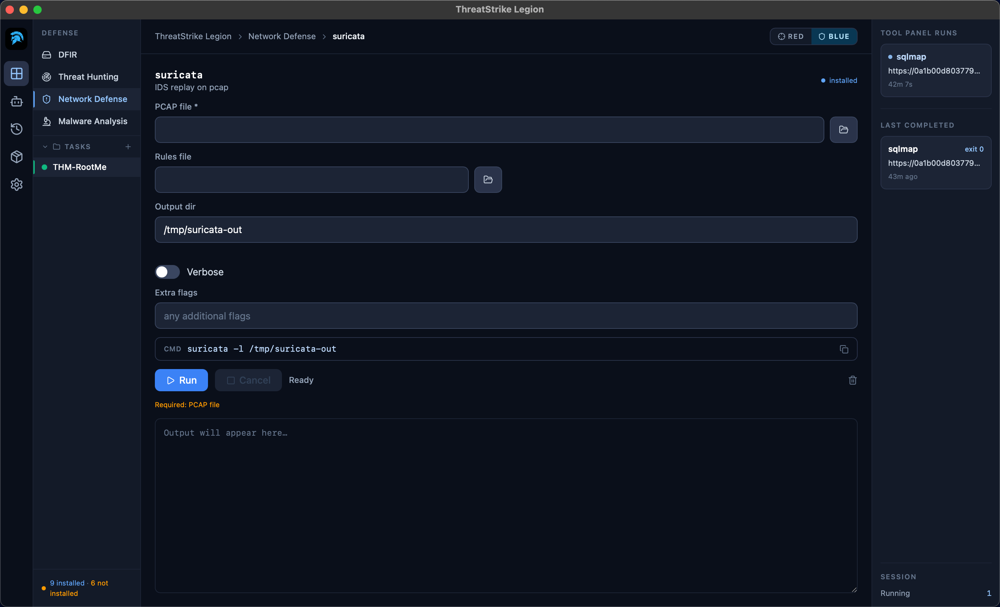

# ThreatStrike Legion

**Pentest tools that don't live in a terminal.**

▶ **[Watch the demo](https://youtu.be/Drv3OSPWdm4)** — Legion solving a TryHackMe box end-to-end.

Every tool you'd reach for on a Kali box, sitting in a real window with every
flag exposed as a field. `nmap`, `ffuf`, `hydra`, `evil-winrm`, `impacket`,
`volatility3`, 45 more. Run them by hand the way you always have, or hand an
objective to the built-in AI agent and let it drive. Same binaries either way.
Same flags. Same output. Just no terminal.

> 🌐 **Website:** https://www.threatstrike.ai
> 💳 **Get the app:** _(launching soon)_
> 📧 **Contact:** security@threatstrike.ai

---

## What it is

ThreatStrike Legion is a commercial desktop pentest workstation for **macOS**
and **Linux**. One download, runs entirely on your machine, no cloud, no
telemetry, no SaaS dashboard. The engagement data lives on your laptop and
nowhere else.

## What's in it

- **A GUI for the Kali toolset.** 62 tools so far ([full list](./TOOLS.md)),
  each one a real form with the real flags exposed. Bundled wordlists,
  interface dropdowns, file pickers, the works.
- **An optional AI agent.** Type the objective in plain English; the agent
  drives the same forms autonomously. Recently solved a TryHackMe-style box
  recon-to-root in 15 minutes, unattended.
- **An engagement knowledge graph.** Every host, service, credential, vuln,
  web path, and screenshot lives in one typed SQLite tree. Severity colors,
  click-to-reveal vault, embedded evidence.
- **A credential vault.** Every secret goes to your OS keychain (Keychain on
  macOS, Secret Service on Linux). The credential-aware tool forms get a
  one-click vault picker. No more `creds.txt` on the desktop.
- **A report builder.** AI drafts the exec summary + per-vuln remediation +
  conclusion. Renders a polished HTML page or PDF (via WeasyPrint) with your
  screenshots embedded and credentials redacted.
- **Red team and blue team.** One toggle in the header flips the entire UI.
  Blue side ships defensive tools (Volatility3, YARA, Sigma, Chainsaw,
  Suricata, capa, floss) and an Analyst agent tuned for DFIR, hunting, and
  detection engineering.

  
- **Bring your own AI.** Claude (CLI subscription or API key), OpenAI,
  Gemini, or any local OpenAI-compatible endpoint (Ollama, LM Studio,
  vLLM, llama.cpp).
- **Bring your own MCP servers.** Paste a Burp, BloodHound, or custom
  MCP server config into Settings; the agent can call it next session.

## Get it

- The launch landing page is at **https://www.threatstrike.ai**.
- A purchase link will be added here when v1 is live.
- Drop your email on the website to be notified the day it ships.

## Requirements

- macOS 12 or later (Apple Silicon or Intel), or Debian 13 / Ubuntu 22+ / Kali.
- For the AI features: a Claude subscription (via Claude Code CLI) **or** an
  Anthropic / OpenAI / Gemini API key **or** any local OpenAI-compatible
  endpoint. Pick one in Settings.
- For PDF reports: WeasyPrint (one-click install from the in-app Setup tab).
- The Kali toolset itself can be installed in one click from the in-app Tool
  Status page; nothing extra to set up manually.

## Status

Pre-launch as of late May 2026. v0.2.0 is feature-complete. Watch this repo
or drop your email on the website for the launch announcement.

## Reporting bugs / requesting features

Use the **Issues** tab on this repository.

For security vulnerabilities please follow [SECURITY.md](./SECURITY.md) — don't
open a public issue.

## Source code

This is the public landing repository. **The source code is not distributed.**
ThreatStrike Legion is closed-source commercial software; the binary is sold
under the terms in [LICENSE](./LICENSE) and the full EULA in [EULA.md](./EULA.md).

## Dual-use notice

ThreatStrike Legion is a computer security testing tool. **You are solely
responsible for the lawful use of this software.** By using it you represent
that you will only assess systems and networks you own or have explicit
written authorization to test. Unauthorized use may violate computer-fraud,
anti-hacking, wiretap, and export laws in many jurisdictions.

---

© 2026 ThreatStrike. All rights reserved.
