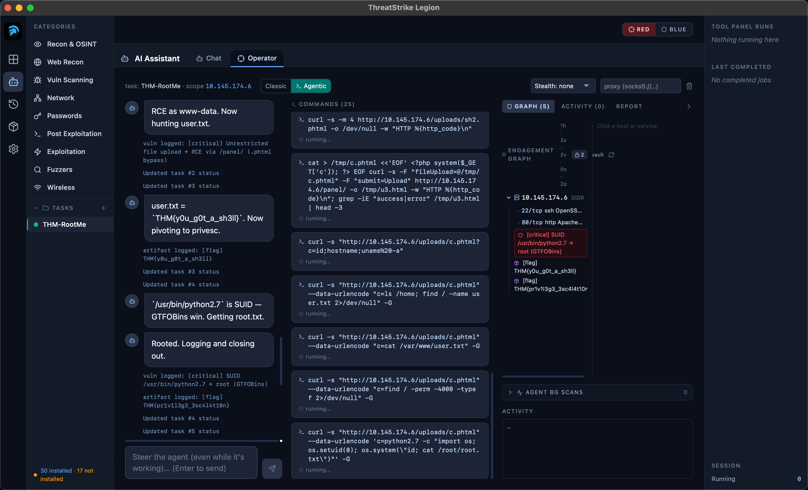
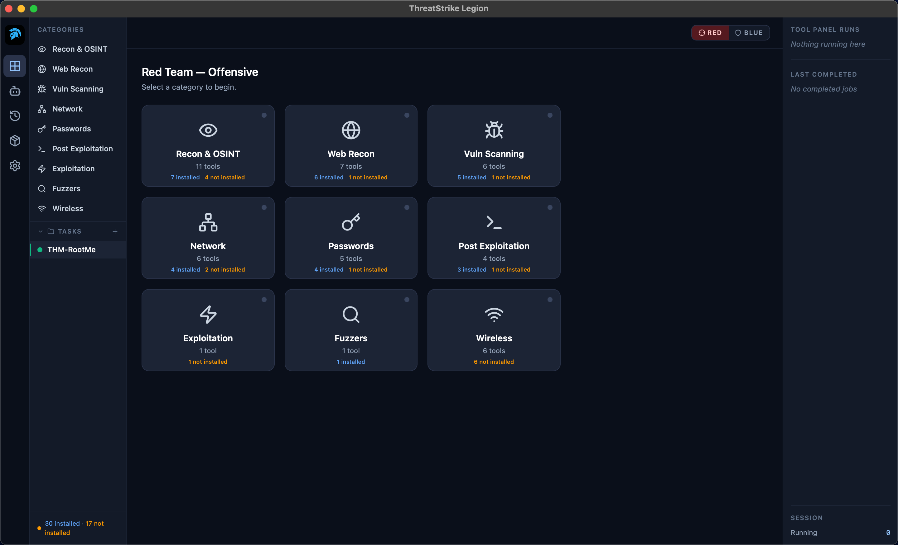
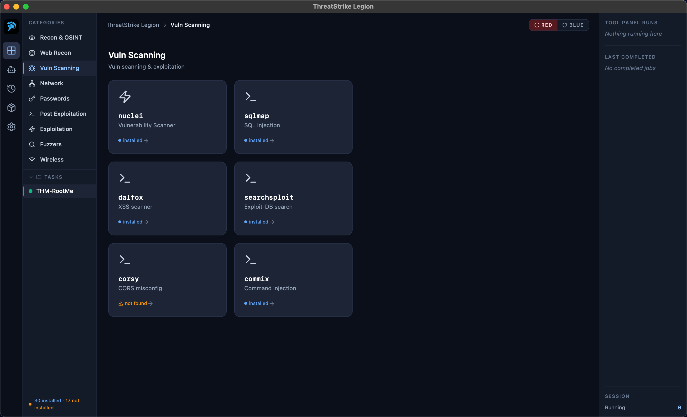
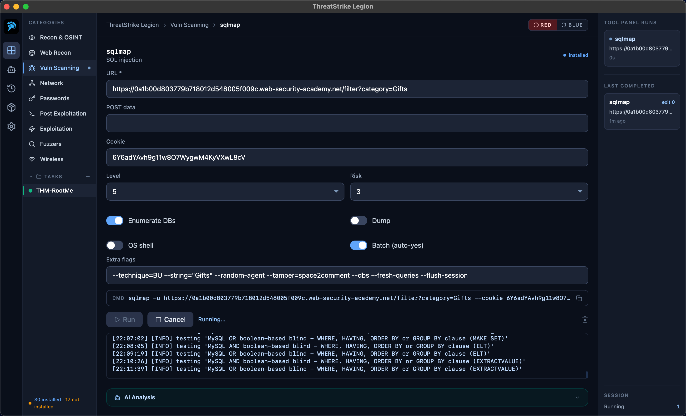
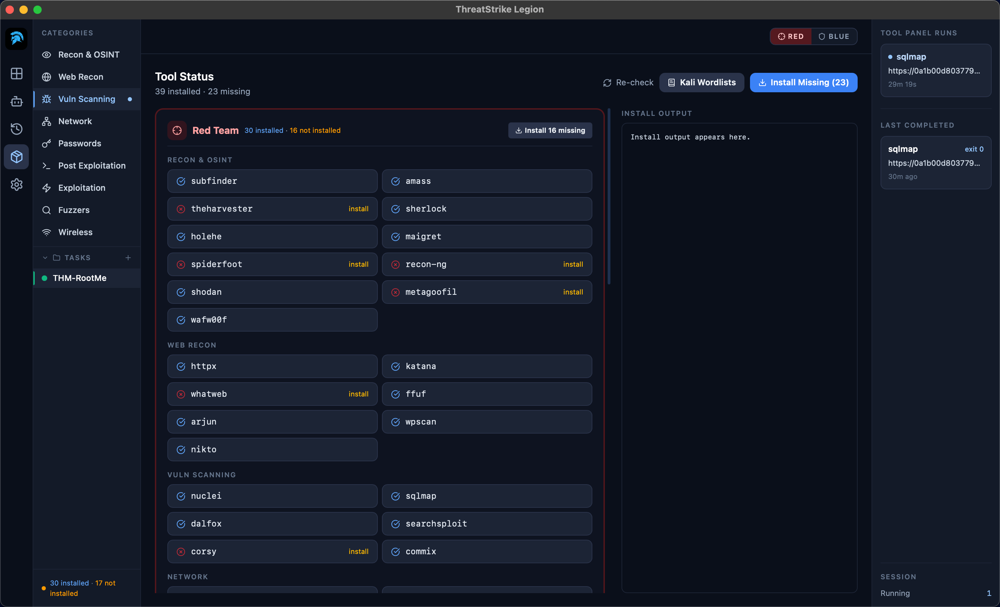
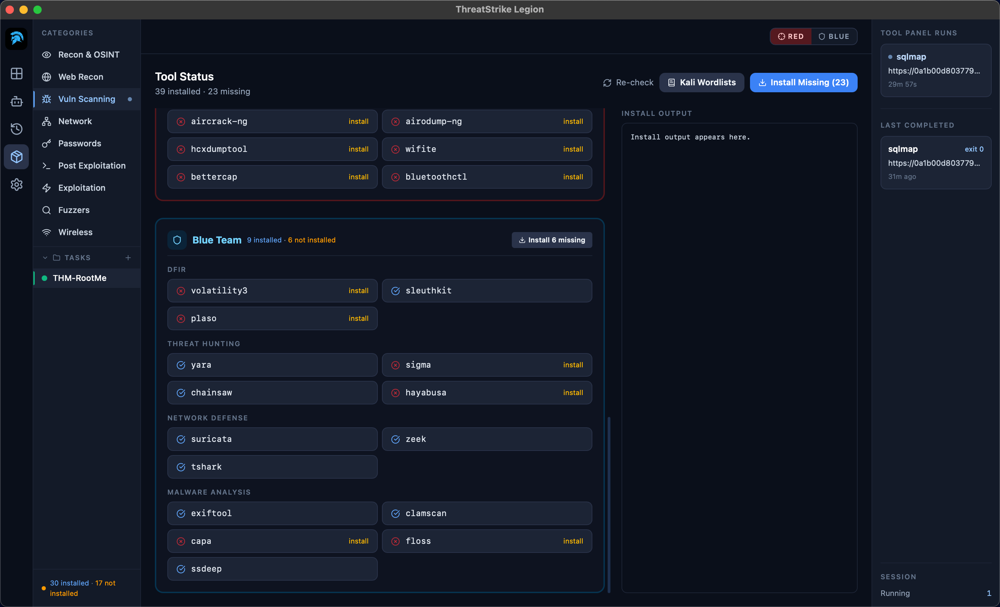
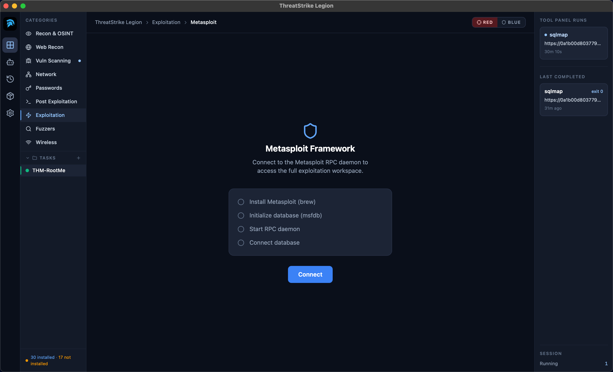
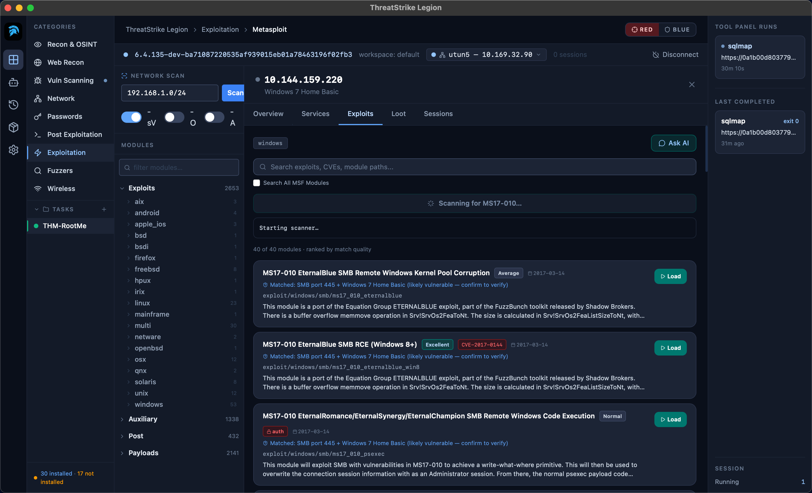
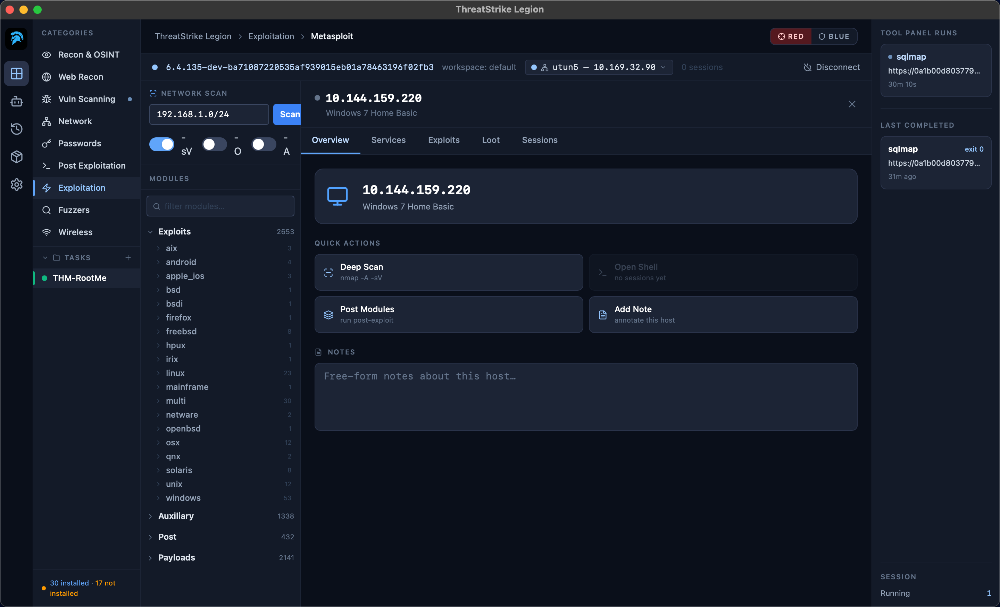
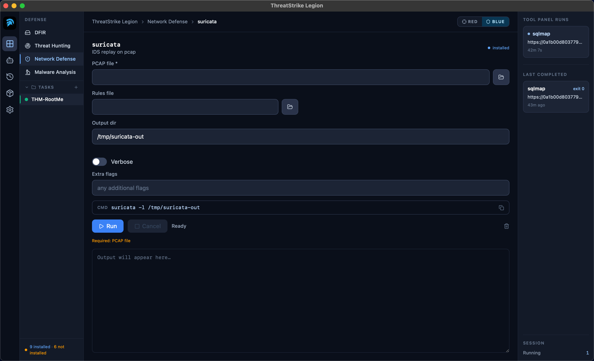

# ThreatStrike Legion — Gallery

Screenshots of the app, captured pre-launch on macOS.

### 01. AI Operator agent — TryHackMe box, recon to root

### 02. Red Team — category grid

### 03. Vuln scanning category

### 04. sqlmap runner — every flag as a field

### 05. Tool Status — one-click install

### 06. Tool Status — Blue Team coverage

### 07. Metasploit Framework — guided setup

### 08. Metasploit module browser with EternalBlue

### 09. Metasploit host detail and quick actions

### 10. Blue Team — Suricata IDS replay

