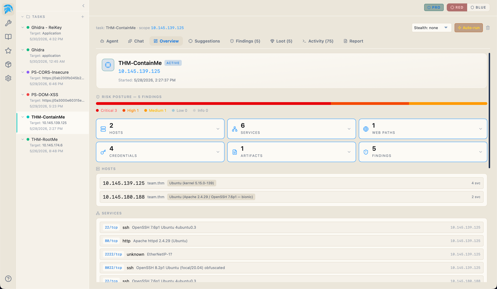
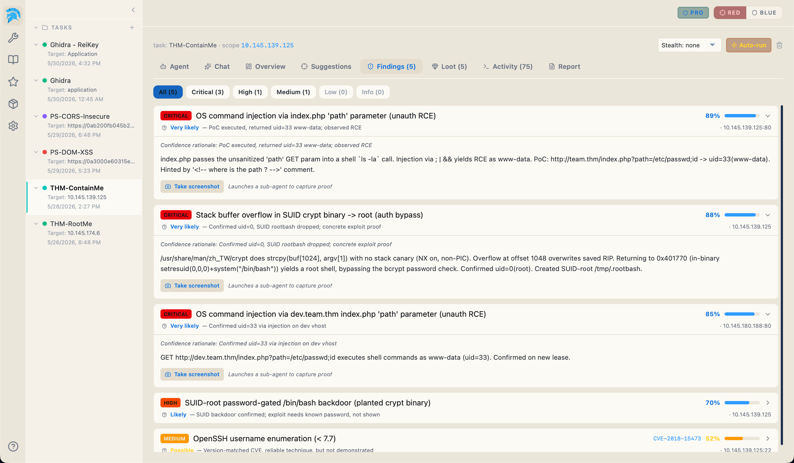
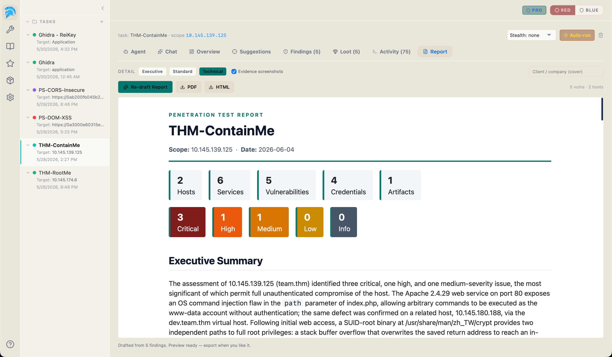
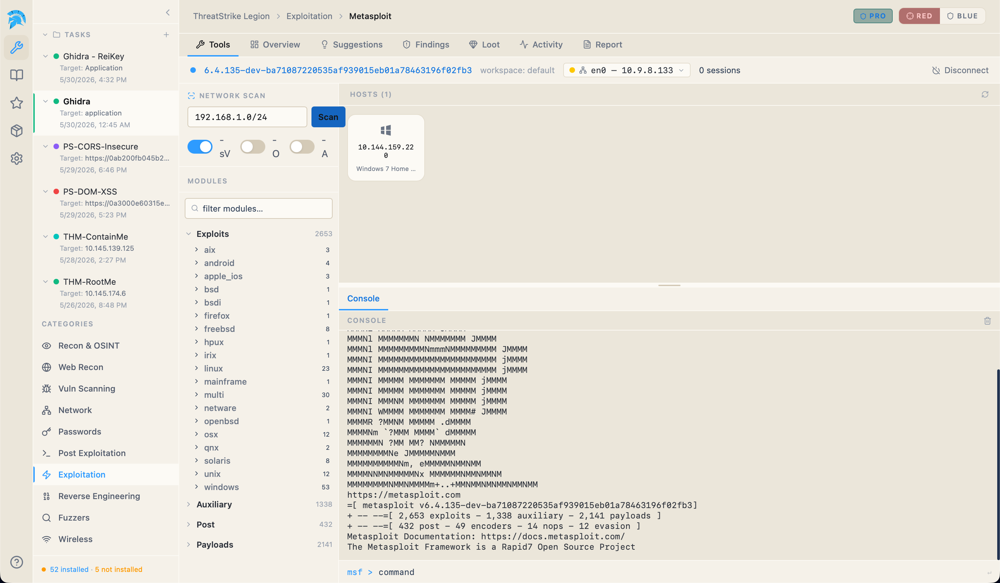
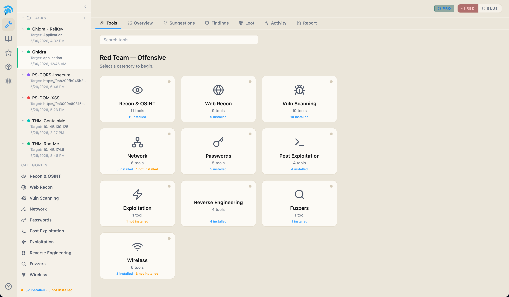
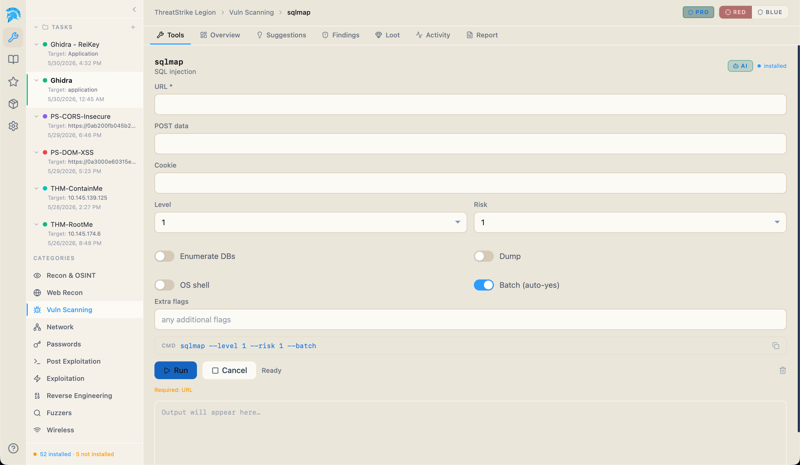
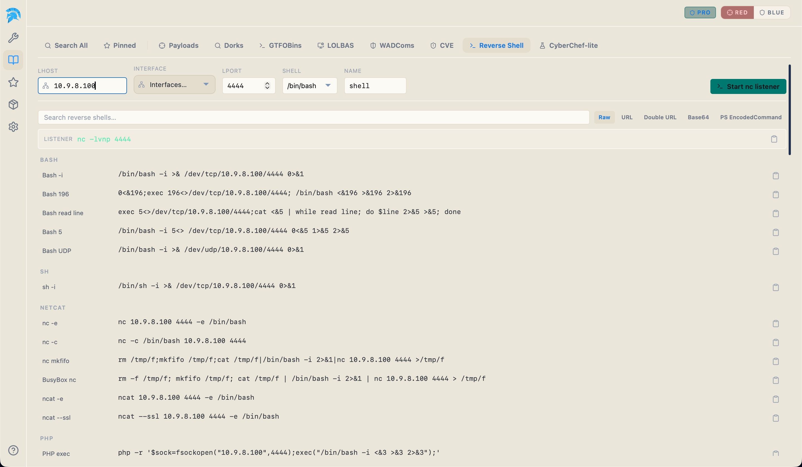
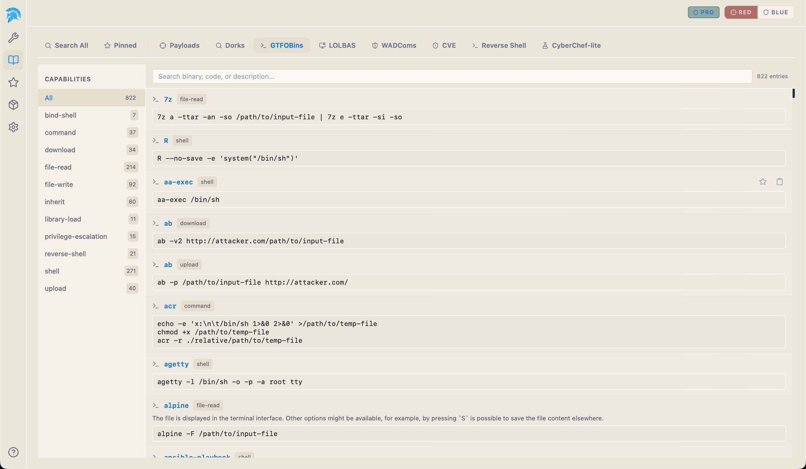

# ThreatStrike Legion - Gallery

Screenshots of the app, captured on macOS.

### 01. Engagement overview

Risk posture, host / service / credential counts, and the live service list for the whole engagement in one view.

### 02. Evidence-backed findings

Each finding confidence-scored and tied to the proof: OS command injection, SUID-to-root overflow, planted backdoors.

### 03. One-click report

An AI-drafted pentest report (executive summary, severity breakdown, per-finding detail), exported to HTML or PDF.

### 04. Metasploit, built in

A live network scan, module browser, and msfconsole in one workspace, with no hand-rolled setup.

### 05. Every tool, organized

The offensive toolkit across ten categories with install status at a glance. One toggle swaps the whole app to blue-team mode.

### 06. Every flag is a field

sqlmap as a form (level, risk, enumerate, dump, OS shell), showing the exact command before you run it.

### 07. Reverse-shell generator

Set LHOST / LPORT / shell and copy a ready payload in any flavor (bash, nc, socat, PHP), with a one-click nc listener.

### 08. Offline reference library

GTFOBins, LOLBAS, WADComs, payloads, dorks, a CVE browser, and a CyberChef-lite, all searchable offline.
